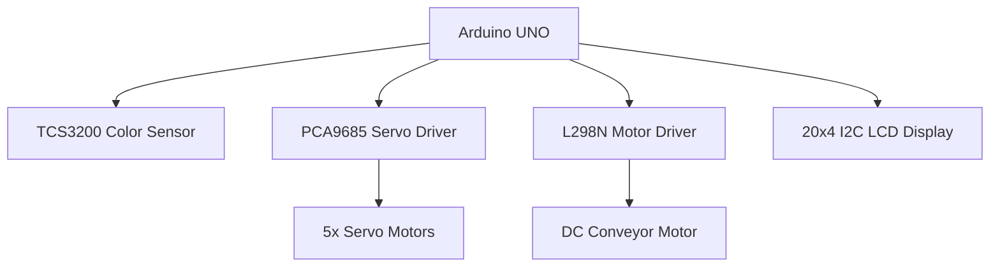
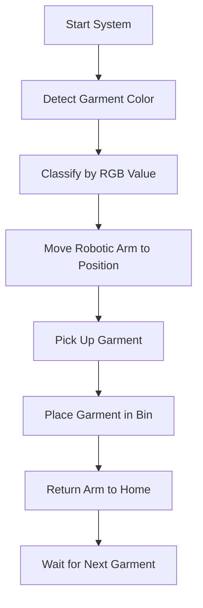

# 🤖 Automated Garment Sorting Robot Arm System
## 📌 Project Overview

This project showcases an intelligent robotic system capable of sorting colored garments using real-time color detection and precise robotic arm automation. Designed for use in laundry facilities, textile recycling, or industrial sorting processes, the system brings together machine vision, embedded control, and modular mechatronics.

---

## ✨ Key Features

| Feature               | Description                                          |
|----------------------|------------------------------------------------------|
| 🎨 **Color Detection**      | TCS3200 sensor reads RGB values from garments        |
| 🤖 **5-DOF Robotic Arm**   | Servo-driven movements using PCA9685 driver         |
| 🚀 **Automated Conveyor**  | IR sensor activates belt for garment delivery       |
| 📊 **Real-time Feedback**  | 20x4 I2C LCD displays detection and sorting status  |
| 🔄 **Modular Architecture**| Independent control units for arm and conveyor      |

---

## 📷 Demo & Media

### 🎬 Demo Video  
[](https://youtu.be/mOCtlV2fK1M)

### 📸 System Images

| Component     | Preview |
|---------------|---------|
| Full Setup    | .jpg?raw=truetext=Full+System+Photo) |
| Robotic Arm   |       |
| Conveyor Unit | /DIAGRAMA%20DE%20CONEXIONES.jpg?raw=true/400x300?text=Conveyor+Unit)       |

---

## 🛠️ Hardware Architecture



---

## 🧠 System Flowchart



---

## 🔧 Installation Instructions

1. **Clone this repository**  
   ```bash
   git clone https://github.com/robinglory/Automated-Garment-Sorting-Robot-Arm-System.git
   ```

2. **Upload Arduino sketches**  
   - Upload `robot_arm/robot_arm.ino` to the **robot arm controller**  
   - Upload `conveyor/conveyor.ino` to the **conveyor controller**

3. **Install Required Arduino Libraries**  
   ```arduino
   Adafruit_PWMServoDriver  
   LiquidCrystal_I2C  
   Wire
   ```

---

## 🚀 How to Use

1. Power on both controllers.
2. Place a colored garment on the conveyor belt.
3. The system will:
   - Automatically detect the garment's color.
   - Move the robotic arm to the correct bin.
   - Pick and place the garment.
   - Return to the home position.

---

## 📁 Project Structure

```
/robot_arm
├── robot_arm.ino         # Main controller logic for robotic arm
├── sequences.h           # Predefined arm movement sequences
└── color_detection.h     # Color sensing and classification

/conveyor
├── conveyor.ino          # Conveyor belt motor control logic
└── motor_control.h       # Low-level motor functions
```

---

## 👤 Developer

[](https://github.com/robinglory)  
**Robin Glory** – System Designer & Developer  
GitHub: [@robinglory](https://github.com/robinglory)

---

## 📜 License

This project is licensed under the **MIT License**.  
See the [LICENSE](LICENSE) file for more details.

---

> 🔬 *This project was developed as part of the fifth year Engineering capstone at WEST YANGON TECHNOLOGICAL UNIVERSITY 
